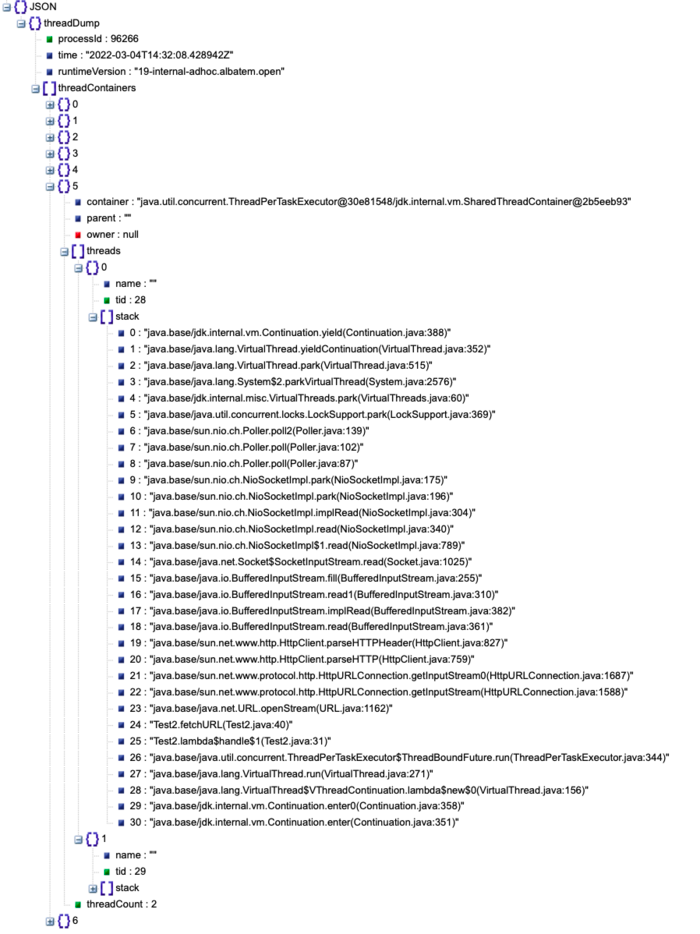

### JEP 440: Record Patterns
record和class功能类似,但不能单独定义,以内部类的形式存在,作用在instanceof或与switch结合使用
#### Motivation
```text
// Prior to Java 16
if (obj instanceof String) {  
        String s = (String)obj;  
        //... use s ...  
}

// As of Java 16  
if (obj instanceof String s) {  
... use s ...  
}
```
#### **[Pattern matching and records](../src/PatternMatchingAndRecords.java)**
```text
public class PatternMatchingAndRecords {
    public static void main(String[] args) {
        //record和class功能类似,但不能单独定义,以内部类的形式存在,作用在instanceof或与switch结合使用
        method1(new Point(1, 2));
    }

    static void method1(Object obj) {
        if (obj instanceof Point p) {
            int x = p.i();
            int y = p.j();
            System.out.println(x + y);
        }
    }

    record Point(int i, int j) {
        public int i() {
            return i;
        }

        public int j() {
            return j;
        }
    }
}
```
#### **[Nested record patterns](../src/NestedRecordPatterns.java)**
```text
public static void main(String[] args) {
    Rectangle r = new Rectangle(new ColoredPoint(new Point(1, 2), Color.RED),
            new ColoredPoint(new Point(3, 4), Color.BLUE));
    printColorOfUpperLeftPoint(r);
}

record Point(int x, int y) {}
enum Color { RED, GREEN, BLUE }
record ColoredPoint(Point p, Color c) {}
record Rectangle(ColoredPoint upperLeft, ColoredPoint lowerRight) {}
//无嵌套
static void printUpperLeftColoredPoint(Rectangle r) {
    if (r instanceof Rectangle(ColoredPoint ul, ColoredPoint lr)) {
        System.out.println(ul.c());
    }
}
//record嵌套
static void printColorOfUpperLeftPoint(Rectangle r) {
    if (r instanceof Rectangle(ColoredPoint(Point p, Color c),
                               ColoredPoint lr)) {
        System.out.println(c);
    }
}
//优化record嵌套
static void printXCoordOfUpperLeftPointWithPatterns(Rectangle r) {
    if (r instanceof Rectangle(ColoredPoint(Point(var x, var y), var c),
                               var lr)) {
        System.out.println("Upper-left corner: " + x);
    }
}
```
#### [Record patterns and exhaustive switch](../src/RecordPatternsAndExhaustiveSwitch.java)
```text
void method1(){
    Pair<A> p1 = new Pair<>(new A(), new B());
    Pair<I> p2 = new Pair<>(new C(), new D());
    switch (p2) {
        case Pair<I>(I i, C c) -> {}
        case Pair<I>(I i, D d) -> {}
    }

    switch (p2) {
        case Pair<I>(C c, I i) -> {}
        case Pair<I>(D d, C c) -> {}
        case Pair<I>(D d1, D d2) -> {}
    }
    //下面这种会报错,switch语句没有覆盖所有可能的输入值
    switch (p2) {                      
        case Pair<I>(C fst, D snd) -> {}
        case Pair<I>(D fst, C snd) -> {}
        case Pair<I>(I fst, C snd) -> {}
    }
    //p2的范型为I,修复后的语句如下
    switch (p2) {
        case Pair<I>(C c, I i) -> {}
        case Pair<I>(D d, I i) -> {}
        case Pair<I>(I fst, C snd) -> {}
        case Pair<I>(I fst, D snd) -> {}
    }
}

class A {}
class B extends A {}
sealed interface I permits C, D {}
final class C implements I {}
final class D implements I {}
record Pair<T>(T x, T y) {}
```
### JEP 409: Sealed Classes
严格的限制哪些类或接口可以继承或实现由Sealed修饰的类
#### Motivation
```text
enum Planet { MERCURY, VENUS, EARTH }

Planet p = ...
switch (p) {
  case MERCURY: ...
  case VENUS: ...
  case EARTH: ...
}
通过类的形似来替换枚举内的属性
```
#### 定义的方式
```text
//permits指定只能由哪些类继承
public abstract sealed class Shape
    permits Circle, Rectangle, Square { ... }

//自动推断Root类的子类
abstract sealed class Root { ... 
    final class A extends Root { ... }
    final class B extends Root { ... }
    final class C extends Root { ... }
}

匿名类或者局部类不能作为permitted类
```
#### sealed修饰的类需遵循的三个原则
```text
sealed class和permitted class要么在同一个模块,要么在同一个包内
每个permitted class必须直接的继承sealed class
每个permitted class必须要使用一个修饰符描述其是如何传播由其父类所启动的封装
可以是final,防止其被继承(record修饰的类默认由final修饰)
可以是sealed,可以被其他类继承,但以一种“限制”的方式
可以是non-sealed,可以被其他的类继承
```
#### Sealed classes in the JDK
```text
public sealed interface ConstantDesc
    permits String, Integer, Float, Long, Double,
            ClassDesc, MethodTypeDesc, DynamicConstantDesc { ... }

// ClassDesc is designed for subclassing by JDK classes only
public sealed interface ClassDesc extends ConstantDesc
    permits PrimitiveClassDescImpl, ReferenceClassDescImpl { ... }
final class PrimitiveClassDescImpl implements ClassDesc { ... }
final class ReferenceClassDescImpl implements ClassDesc { ... } 

// MethodTypeDesc is designed for subclassing by JDK classes only
public sealed interface MethodTypeDesc extends ConstantDesc
    permits MethodTypeDescImpl { ... }
final class MethodTypeDescImpl implements MethodTypeDesc { ... }

// DynamicConstantDesc is designed for subclassing by user code
public non-sealed abstract class DynamicConstantDesc implements ConstantDesc { ... }
```
#### Reflection API
- Class<?>[] getPermittedSubclasses()
- boolean isSealed()
```text
public static void main(String[] args) {
    boolean sealed = I.class.isSealed();
    System.out.println(sealed);
    Class<?>[] permittedSubclasses = I.class.getPermittedSubclasses();
    for (Class clazz : permittedSubclasses){
        System.out.printf(clazz.getName());
    }
}
sealed interface I permits C, D {}
final class C implements I {}
final class D implements I {}
```
### JEP 444: Virtual Threads
#### Summary
```text
虚拟线程是轻量级的线程,减小了写和维护的影响,提供高吞吐的并发应用
```
#### History
着重说明以下两点
- jdk21中是支持thread-local变量的,并且已经存在的库没有任何改变的去使用虚拟线程  
- 虚拟线程的创建方式有两种
   - Thread.Builder API,
   - Executors.newVirtualThreadPerTaskExecutor(),并且可以监控其生命周期和通过转储新的线程实现可视化
```text
系统属性 jdk.traceVirtualThreadLocals 可用于在虚拟线程设置任何thread-local变量的值时触发堆栈跟踪
使用方式:
java -Djdk.traceVirtualThreadLocals=true YourApplication
```
#### Goals
- 让应用服务在“一个请求一个线程(请求独占线程)”的形式中以硬件最佳利用率的方式进行扩展
- 以最小的改变让java.lang.Thread API接受virtual threads
- 使用已经存在的jdk工具,很容易的做问题定位,调试,并对virtual threads剖析
```text
这里需要说明下thread-per-request
"Thread-per-request" 是一种设计模式，通常在 Web 开发中使用。
该模式的基本思想是为每个客户端请求创建一个新的线程来处理。
每个请求都在自己的线程中运行，以避免阻塞对其他请求的响应。
这通常用于处理短暂的、相对独立的任务，以提高并发性能。
中文翻译为 "请求独占线程" 或 "每个请求一个线程"。在这种模式下，每个客户端请求都有一个专门的线程来处理，以确保请求之间的独立性和并发性
```
#### Non-Goals
- 不是为了移除传统的线程实现方式,或者迁移已经存在的应用去使用虚拟线程
- 不是为了改变基本的java并发模型
- 不是为了在java语言或java库中提供一个新的数据并发结构,stream api仍旧是更可取的以并发的形式去处理大数据的方式
#### The thread-per-request style
```text
thread-per-request style很容易理解,编码,调试和配置,因为它使用平台/系统的并发单元表示应用的并发单元.
但这种方式在实际的使用中是不适用的,因为这种方式意味着线程会随着请求数的增长而不断增加,但jdk实现的线程是受操作系统的线程限制的,jdk的线程实现将应用程序的吞吐量限制在远低于硬件所能支持的水平,即便线程池化,其也是降低了开启一个新线程的创建的消耗,并没有增加可创建的线程数.  
Little's Law(小定律)
是一个与队列理论相关的数学公式，它描述了在一个稳态系统中，队列中的平均项目数、平均到达率和平均等待时间之间的关系.
Little's Law（小定律）是一个与队列理论相关的数学公式，它描述了在一个稳态系统中，队列中的平均项目数、平均到达率和平均等待时间之间的关系.
Little's Law 的数学表达式如下：
L=λW
其中：
L 是系统中平均的项目数（队列长度）。
λ 是平均到达率，即每单位时间到达系统的项目数。
W 是平均等待时间，即一个项目在系统中的平均逗留时间。
这个定律在排队理论、性能分析以及系统优化中有着广泛的应用。
```
#### Improving scalability with the asynchronous style
```text
线程池化采用的是线程共享的方式,有请求的时候才会去执行,否则会回到线程池等待请求,这种方式的好处是只有在执行的时候才会持有线程,等待的时候不会.
通过异步就移除了由于系统线程的不足而强加进来的吞吐量限制,其会使用一组不等待 I/O 操作完成的独立 I/O 方法，而是稍后通过回调通知其完成.在没有专用线程的情况下,开发者必须要将他们的请求逻辑拆分成小的阶段,然后使用api把他们组合成顺序的流水线.
例如 CompletableFuture或者"reactive" 框架
异步编程风格与 Java 平台的原有设计理念相悖。在传统的 Java 并发模型中，应用程序的并发单位通常是线程，而在异步编程风格中，应用程序的并发单位变成了异步流水线。
传统的 Java 编程中，开发者习惯使用多线程模型来处理并发任务。每个线程代表一个并发执行的单元。但是，异步编程风格使用异步操作，通过回调等方式来处理并发任务，而不是传统的阻塞模型。
上述句子指出，在这种新的异步编程风格中，应用程序的并发单位不再是线程(也就不再是平台/系统的线程)，而是异步流水线。这意味着原有的 Java 并发模型与这种新的编程风格存在矛盾，因为它改变了应用程序的并发单位。
```
#### Preserving the thread-per-request style with virtual threads
```text
正如操作系统通过将大的虚拟地址空间映射到有限的物理RAM来制造内存充足的假象一样，Java运行时可以通过将大量的虚拟线程映射到少量的操作系统线程来制造线程充足的假象.
虚拟线程是java.lang.Thread的一个实例，它不绑定到特定的操作系统线程。相比之下，平台线程是java.lang.Thread的一个实例，以传统的方式实现，作为对操作系统线程的薄包装.
在thread-per-request编程风格中的应用代码可以在整个请求的持续时间内运行在一个虚拟线程中，但是虚拟线程仅在执行 CPU 计算时消耗一个操作系统线程。结果是与异步风格相同的可扩展性，只不过这是透明地实现的：当在虚拟线程中运行的代码调用 java.* API 中的阻塞 I/O 操作时，运行时执行非阻塞的操作系统调用，并自动挂起虚拟线程，直到稍后可以恢复.对于Java开发人员来说，虚拟线程就是创建成本低廉且几乎无穷无尽的线程.硬件利用率接近最优，允许高度并发，从而实现高吞吐量，同时应用程序保持与Java平台及其工具的多线程设计和谐一致.
```
#### Implications of virtual threads
```text
虚拟线程是廉价且充足的，因此不应该进行线程池化：每个应用程序任务应该为其创建一个新的虚拟线程。因此，大多数虚拟线程将是短暂的，具有浅层调用堆栈，执行的任务可能仅仅是一个HTTP客户端调用或一个JDBC查询。相比之下，平台线程是重量级的且昂贵的，因此通常需要进行线程池化。它们倾向于长时间存在，具有深层调用堆栈，并在许多任务之间共享。
总的来说，虚拟线程保留了可靠的“一个请求一个线程”的风格，与Java平台的设计和谐一致，同时最大程度地利用了可用的硬件。使用虚拟线程不需要学习新概念，尽管可能需要摒弃为应对当前线程成本较高而养成的一些习惯。虚拟线程不仅有助于应用程序开发人员，还有助于框架设计人员提供易于使用的API，既与平台的设计兼容，又不会在可扩展性方面做出妥协.
```
#### Description
```text
目前，JDK中的每个java.lang.Thread实例都是一个平台线程。平台线程在底层的操作系统线程上运行Java代码，并在代码的整个生命周期中占用操作系统线程。平台线程的数量受限于操作系统线程的数量。
虚拟线程是java.lang.Thread的一个实例，它在底层的操作系统线程上运行Java代码，但并不在代码的整个生命周期中占用操作系统线程。这意味着许多虚拟线程可以在同一个操作系统线程上运行它们的Java代码，有效地共享它。而平台线程垄断了一个宝贵的操作系统线程，虚拟线程则不会。虚拟线程的数量可以远远大于操作系统线程的数量。
虚拟线程是由JDK提供的轻量级线程实现，而不是由操作系统提供。它们是一种用户模式线程的形式，在其他多线程语言中已经取得了成功（例如，Go语言中的goroutines和Erlang语言中的进程）。在Java的早期版本中，甚至有所谓的“绿色线程”，当时操作系统线程还没有成熟和普及。然而，Java的绿色线程都共享一个操作系统线程（M:1调度），并最终被作为操作系统线程的包装（1:1调度）实现的平台线程超越。虚拟线程采用M:N调度，其中大量（M）的虚拟线程被调度在较少（N）的操作系统线程上运行。
```
#### Using virtual threads vs. platform threads
```text
这句话的意思是，如果程序中的任务需要执行一个长时间的计算（例如，对一个巨大数组进行排序），而不仅仅是进行睡眠操作，那么增加线程的数量超过处理器核心数量可能不会带来帮助，无论这些线程是虚拟线程还是平台线程。
这是因为处理器核心的数量代表了实际的计算资源，如果任务是纯粹的 CPU 密集型任务，并且需要一秒钟的时间才能完成，那么拥有超过核心数的线程数量不会导致并行执行。在这种情况下，管理额外线程的开销可能会由于增加上下文切换和争用资源而导致总体性能下降。
在涉及到大量计算工作的任务中，由于可用处理器核心数量的限制，通过并行化获得的性能提升通常是有限的。添加超过核心数的线程可能不会带来相应性能的增加，甚至在某些情况下可能会降低性能。
在设计并发程序时，重要的是要考虑任务的性质和工作负载的特征，以便确定使用的线程数量的最佳选择。
虚拟线程不是为了让代码运行更快而设计的,它们不会比平台线程执行代码更快。它们的存在是为了提供更高的吞吐量,而不是速度（更低的延迟）.
虚拟线程与平台线程相比，并没有设计成能够以更快的速度执行代码。它们不会通过某种方式使单个任务的执行速度更快.
虚拟线程可以提供应用吞吐量的前提条件是并发的任务很高(超过几百个),并且工作负载不是cpu绑定的,因为拥有比处理核心数更多的线程数并不能提高吞吐量.
创建虚拟线程的方式:
- Executor.newVirtualThreadPerTaskExecutor()
-  java.lang.Thread.Builder
此外structured concurrency可以创建和管理虚拟线程.
```
#### Do not pool virtual threads
```text
创建数据库连接是非常昂贵的,传统的做法是使用线程池去管理数据库连接,不建议从线程池化转为使用虚拟线程,因为从固定数量线程的线程池转为使用虚拟线程,可能会降低性能.
```
#### Observing virtual threads
```text
JDK Flight Recorder (JFR)是 Java 虚拟机（JVM）的一个性能监测和故障诊断工具。
它允许开发人员在应用程序运行时收集详细的性能数据，以便进行分析和优化。
Java Flight Recorder 提供了对 JVM 运行时行为的详尽记录，包括线程活动、垃圾收集、方法运行时间、内存分配等方面的信息。
这些记录可用于分析应用程序在不同时间点的性能特征，帮助开发人员识别和解决潜在的性能问题。
JFR 可以在应用程序运行期间动态启用，而且其开销相对较小，因此可以用于生产环境中。
它为开发人员提供了一种强大的工具，用于监测和调整 Java 应用程序的性能.但是其不能监控异步任务.
传统的thread dump适合于平台线程的问题定位,但不适合于虚拟线程,例如jstack或jcmd命令.
可以使用structured concurrency对虚拟线程进行监控和管理,
对传统的平台线程的jcmd命令进行扩展,实现thread dump
```
> jcmd <pid> Thread.dump_to_file -format=json <file>
```text
新的线程转储格式不包括对象地址、锁、JNI 统计、堆统计以及传统线程转储中出现的其他信息。
此外，由于可能需要列举大量线程，生成新的线程转储不会暂停应用程序。
如果系统属性 jdk.trackAllThreads 设置为 false，即使用 -Djdk.trackAllThreads=false 命令行选项，通过 Thread.Builder API 直接创建的虚拟线程将不会始终被运行时跟踪，可能不会出现在新的线程转储中。在这种情况下，新的线程转储将列出在网络 I/O 操作中被阻塞的虚拟线程，以及上面示例中通过 new-thread-per-task ExecutorService 创建的虚拟线程。
```

```text
由于虚拟线程是在 JDK 中实现的，并且不绑定到任何特定的操作系统线程，它们对操作系统是不可见的，操作系统并不知道它们的存在。在操作系统级别的监视中，会观察到 JDK 进程使用的 OS 线程比虚拟线程多。
```
#### Scheduling virtual threads(调度虚拟线程)
```text
为了执行有用的工作，线程需要被调度，即分配到处理器核心上执行。对于作为操作系统线程实现的平台线程，JDK 依赖于操作系统中的调度器。相反，对于虚拟线程，JDK 使用自己的调度器。JDK 的调度器不会直接将虚拟线程分配给处理器，而是将虚拟线程分配给平台线程（这是前面提到的虚拟线程的 M:N 调度）。然后，这些平台线程会像通常一样由操作系统进行调度。
JDK 的虚拟线程调度器是一个采用先进先出（FIFO）模式的 work-stealing ForkJoinPool。调度器的并行度是可用于调度虚拟线程的平台线程数量。默认情况下，它等于可用处理器的数量，但可以通过系统属性
jdk.virtualThreadScheduler.parallelism 进行调整。这个 ForkJoinPool 是独立于通用池的，通用池在诸如并行流实现中使用，以后进先出（LIFO）模式运行
调度器分配给虚拟线程的平台线程被称为虚拟线程的载体（carrier）。虚拟线程在其生命周期内可以被调度到不同的载体上；换句话说，调度器不会保持虚拟线程与任何特定平台线程的亲和关系。从 Java 代码的角度来看，运行中的虚拟线程在逻辑上独立于其当前的载体：
```
- 载体的身份对于虚拟线程是不可见的
  - 虚拟线程无法获取其载体的身份
- 载体和虚拟线程的堆栈跟踪是分开的
  - 虚拟线程中抛出的异常不会包含载体的堆栈帧。线程转储不会在虚拟线程的堆栈中显示载体的堆栈帧，反之亦然。
- 载体的线程局部变量对于虚拟线程是不可见的，反之亦然
  - 载体的线程局部变量对于虚拟线程是不可用的，反之亦然
```text
这些特性强调了虚拟线程与其载体之间的独立性。虚拟线程的执行与其在平台线程上的调度是透明的，从而简化了线程管理的复杂性。
此外，从Java代码的角度来看，虚拟线程及其载体暂时共享一个操作系统线程的事实是不可见的。相反，从本地代码的角度来看，虚拟线程及其载体在同一个本地线程上运行。在同一个虚拟线程上多次调用的本地代码可能会在每次调用时观察到不同的操作系统线程标识符。
目前，调度器不实现虚拟线程的时间共享。时间共享是对已消耗分配的CPU时间的线程进行强制抢占。虽然时间共享在有相对较少的平台线程且CPU利用率达到100%时可以降低某些任务的延迟，但不清楚在拥有数百万虚拟线程时时间共享是否会同样有效。
```


